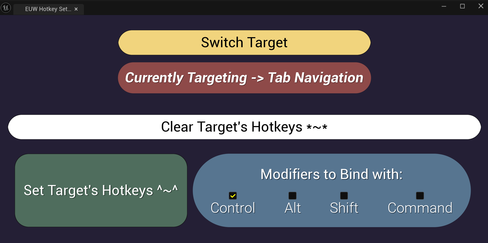

# Unreal-Motions 🖐️✨
Unreal Engine ergonomic tools that will keep your hands (and soul!) healthy[er] 🧘‍♂️

## Features 
### Tab Navigation 🔄
Navigate between editor tabs using customizable keyboard shortcuts just like you navigate browser tabs!<br>
The plugin is designed to work alongside existing Unreal Engine shortcuts:
- By default, the plugin uses `Ctrl + Shift + 0-9` to avoid conflicts with Unreal's built-in Viewport & BP Graph Editor Bookmark shortcuts (`Ctrl + 0-9`)
- The plugin won't override any existing shortcuts by default, but I definitely recommend using the Blueprint Utility Widget I provide or manually changing the tab navigation to use Ctrl + 0-9 and moving Bookmarks to Ctrl + Shift + 0-9.
- The Tab shortcuts can be found in Edit -> Editor Preferences -> Keyboard Shortcuts:<br>
Type in the search bar "Focus Tab" and you should see the custom tab commands you can customize.

### Editor Utility Widget ⚡

Since some users (ME) might prefer to move their bookmarks to `Ctrl + Shift + 0-9`, I've included a Editor Utility Widget that lets you:
- Easily clear and set hotkeys for bookmarks (or the custom tab navigation hotkeys) 0-9
- Automatically setup hotkeys for bookmarks or tab navigation with different modifiers to find your perfect configuration!

## Support & Installation 🔧
1. The plugin should work safely in UE 5.3 to 5.5. I believe 5.0+ should also work (but haven't tested that). Keep in mind that the Editor Utility Widget won't show up in versions earlier than 5.3. If really needed you can manually copy paste the logic and recreate it.
1. Create a `Plugins` folder in your Unreal Engine project's root directory (if it doesn't exist)
2. Clone this repository into the `Plugins` folder:
```bash
# From your project's root directory
cd Plugins
git clone https://github.com/BarakXYZ/ErgonomicsXYZ.git
```
3. Restart the Unreal Editor
4. The plugin should now be available in your project!

## Roadmap 🗺️
I'm heavily inspired by Vim Motions, and so I'm definitely gonna expand this plugin in the near future with more ergonomic tools! 🚀

## Contributing 🤝
Bug reports and feature suggestions are welcome!

## Thank You! ❤️
- [BenUI](https://github.com/benui-dev) and the Discord community for their support
- [kirby561](https://github.com/kirby561) for the amazing hotkeys tutorial!
