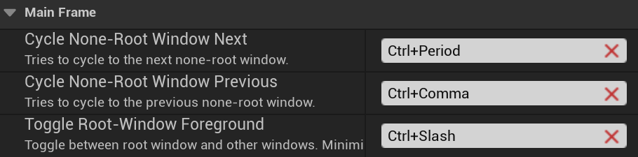
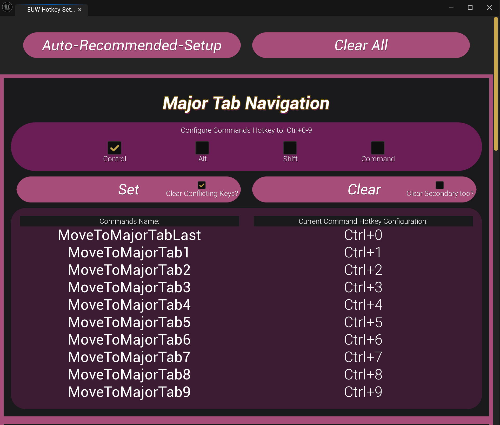
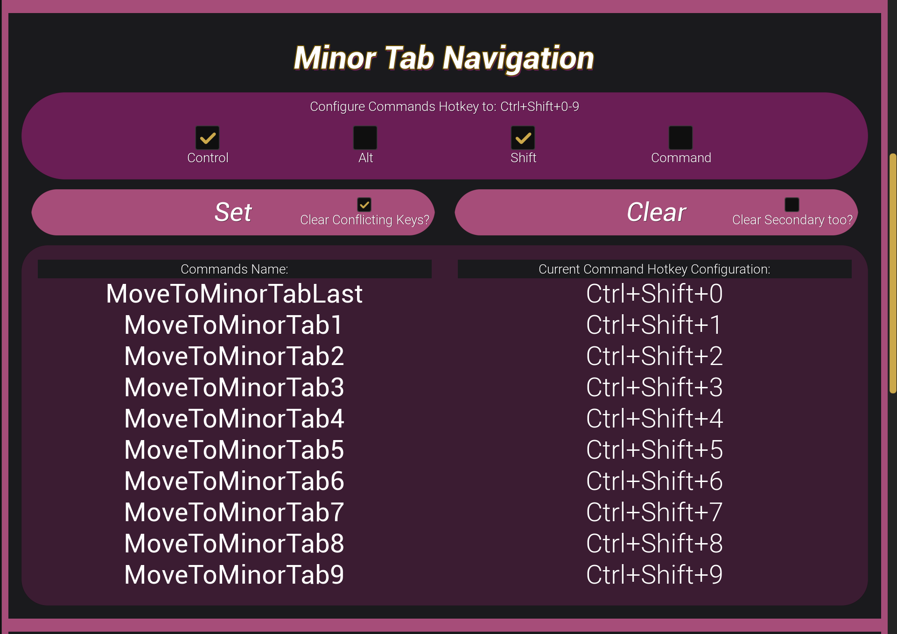
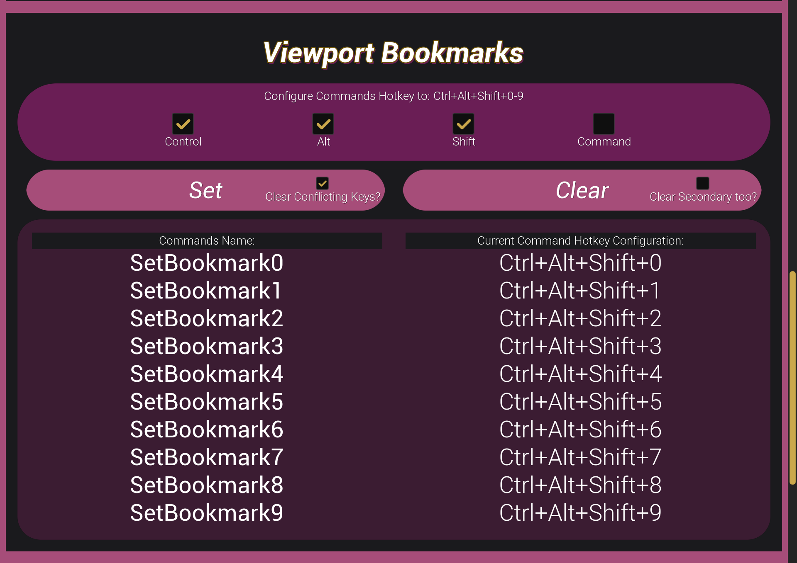
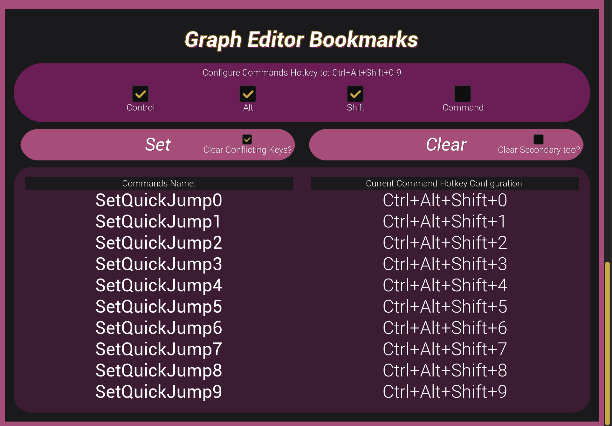

# Unreal-Motions 🖐️✨

This project started with simple motions for tab and window navigation, but it has since evolved into a full-fledged Vim Motions system! I'll be working on another official release in the coming weeks, focusing on stability and proper documentation. Stay tuned! For now the official release contains the tab & window navigation features while main has many of the Vim features already implemented (if you want to try them out) 🧘‍♂️

### Things left until Vim features release:

- [x] Vimium generic UI navigation (via Hint Markers).
- [x] General UI Vim Motions-like navigation between panels and Minor Tabs.
- [x] Go-In "i" go-Out "o" to quickly move in/out of previous/next widgets (supports widgets that live inside different tabs and windows too!)
- [x] Fallback mechanisms to retain focus on last selected widgets inside tabs (Nomad & Panel).
- [x] Blueprint Nodes Vim-Motions (HJKL, w, b, e, ge, gg, G, d, x)
- [x] Blueprint panel navigation (panning) via Shift + HJKL.
- [x] Command-Line like pop-up for basic commands like :w, :q, etc.
- [x] Search-Box like pop-up menu for Shift + / like free search.
- [ ] Editable Text Vim-Motions (Single & MultiLine).
- [ ] Basic Level-Viewport Vim-inspired navigation (for rotation and moving around without the mouse).
- [ ] Basic config setup for enabling // disabling Vim features and some preferences.
- [ ] UI, Highlighting cleanup and fine-tuning.

- Estimated Vim-Features Release Date: May-June 2025.

## Features Present in latest release:

### Windows Navigation 🪟

Navigate between editor windows effortlessly using keyboard shortcuts!<br>

- Use `Ctrl + Period` to cycle to the next none-root window and `Ctrl + Comma` to cycle to the previous none-root window
- Toggle between root window and other windows using `Ctrl + Forward Slash` - minimizes non-root windows to focus root window, or vice versa
- You can expect solid focus activation when navigating between windows (unlike UE's occasional issue where focus remains on the previous window after navigation)
- Customize any hotkey configuration in preferences - simply search for "Cycle Window" to find all available commands
  

### Major & Minor Tab Navigation 🔄

Navigate between editor tabs using customizable keyboard shortcuts just like you navigate browser tabs!<br>
The plugin is designed to work alongside existing Unreal Engine shortcuts:

- By default, the plugin uses `Ctrl + Shift + 0-9` for Major Tabs && `Ctrl + Alt + Shift + 0-9` for Minor Tabs to avoid conflicts with Unreal's built-in Viewport & BP Graph Editor Bookmark shortcuts (`Ctrl + 0-9`).
- The plugin won't override any existing shortcuts by default, but I definitely recommend using the Editor Utility Widget I provide to change Major Tab navigation to use `Ctrl + 0-9` && Minor Tab navigation to use `Ctrl + Shift + 0-9` and accordingly to move Viewport & Graph Bookmarks to `Ctrl + Alt + Shift + 0-9`.
- Another way to navigate between tabs is using `Ctrl + ]` for moving to the next tab, and `Ctrl + [` for moving to the previous tab. Similarly, you can navigate back and forth in Minor Tabs using `Ctrl + Shift + ]` & `Ctrl + Shift + [`.<br>
  You can of course adjust these hotkeys to your liking in Preferences (for example override the default next tab shortcut `Ctrl + Tab` & back `Ctrl + Shift + Tab`!).
- The Tab shortcuts can be found in Edit -> Editor Preferences -> Keyboard Shortcuts:<br>
  Type in the search bar "Focus Tab" and you should see the custom tab commands you can customize.

### Editor Utility Widget ⚡





Since some users (muah) might prefer to move their bookmarks to `Ctrl + Alt + Shift + 0-9`, I've included a Editor Utility Widget that lets you:

- Easily clear and Auto-Setup Hotkeys to the recommened or any configuration you like quickly and easily!
- Have a quick overview of the currently set configuration and hotkeys.
- Try out different modifiers to find your perfect configuration and iterate quickly!

## Support & Installation 🔧

1. The plugin should work safely in UE 5.3 to 5.5. I believe 5.0+ should also work (but haven't tested that). Keep in mind that the Editor Utility Widget won't show up in versions earlier than 5.3. If really needed you can manually copy paste the logic and recreate it.
1. Create a `Plugins` folder in your Unreal Engine project's root directory (if it doesn't exist)
1. Clone this repository into the `Plugins` folder:

```bash
# From your project's root directory
cd Plugins
git clone https://github.com/BarakXYZ/Unreal-Motions.git
```

3. Restart the Unreal Editor
4. The plugin should now be available in your project!

## Contributing 🤝

Bug reports, PR's and feature suggestions are welcome!

## Thank You! ❤️

- [BenUI](https://github.com/benui-dev) and the Discord community for their support
- [kirby561](https://github.com/kirby561) for the amazing hotkeys tutorial!
