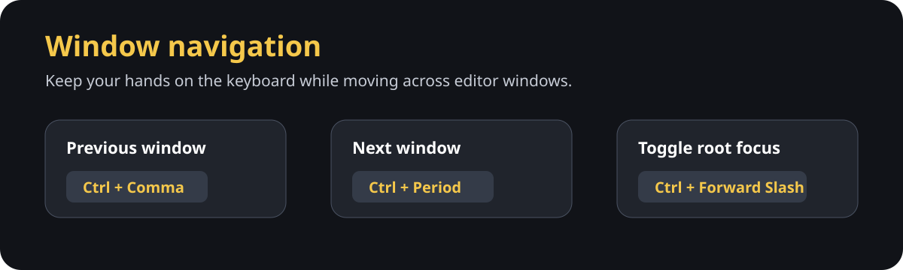
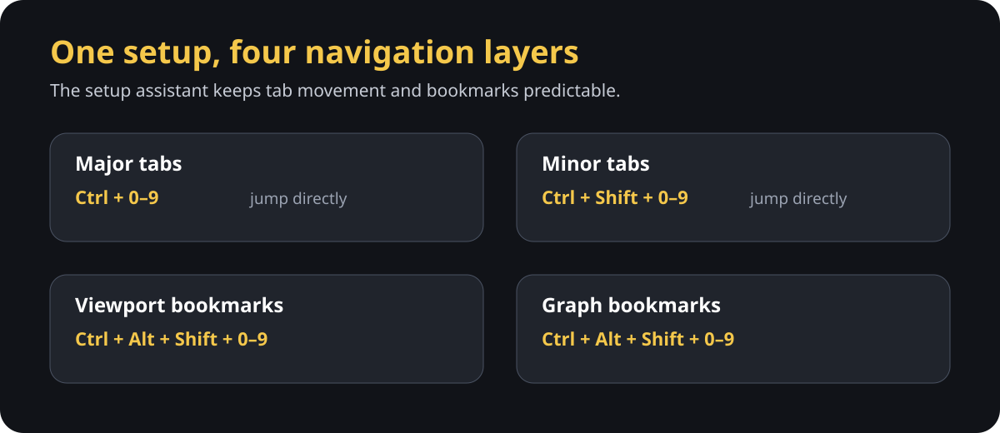

# Unreal-Motions 🖐️✨

[](LICENSE)

Unreal Motions is a keyboard-centric navigation plugin for Unreal Editor. It started with tab and window movement and has grown into a broader Vim-inspired interaction system for editor UI, Blueprint graphs, search, and text editing.

Unreal Motions is MIT licensed. You may use it commercially, modify it, redistribute it, keep changes private, sublicense it, or sell copies. The only license condition is preserving the copyright and license notice.

## Vim feature coverage

- [x] Customizable Vim-like bindings (\<leader> + n [number of keys]) to call any type of functionality.
- [x] Normal, Visual and Insert mode: custom Input Processor and Message Handler.
- [x] Fallback mechanisms to retain focus on last selected widgets inside tabs (Nomad, Panel, etc.)
- [x] Vimium generic UI navigation (via Hint Markers).
- [x] General UI Vim Motions-like navigation between panels and Minor Tabs.
- [x] Go-In "ctrl + i" Go-Out "ctrl + o" to quickly move in/out of previous/next widgets (supports widgets that live inside different tabs and windows too!)
- [x] Blueprint Nodes Vim-Motions (HJKL, w, b, e, ge, gg, G, d, x)
- [x] Blueprint panel navigation (panning) via Shift + HJKL.
- [x] Command-Line like pop-up for basic commands like :w, :q, etc.
- [x] Search-Box like pop-up menu for Shift + / like free search.
- [ ] Editable Text Vim-Motions (Single & MultiLine).
- [ ] Basic Level-Viewport Vim-inspired navigation (for rotation and moving around without the mouse).
- [ ] Basic config setup for enabling or disabling Vim features and preferences.
- [ ] UI, Highlighting cleanup and fine-tuning.

## Features in version 1.1.0

### Windows Navigation 🪟

Navigate between editor windows effortlessly using keyboard shortcuts!<br>

- Use `Ctrl + Period` to cycle to the next none-root window and `Ctrl + Comma` to cycle to the previous none-root window
- Toggle between root window and other windows using `Ctrl + Forward Slash` - minimizes non-root windows to focus root window, or vice versa
- You can expect solid focus activation when navigating between windows (unlike UE's occasional issue where focus remains on the previous window after navigation)
- Customize any hotkey configuration in preferences - simply search for "Cycle Window" to find all available commands
  

### Major & Minor Tab Navigation 🔄

Navigate between editor tabs using customizable keyboard shortcuts just like you navigate browser tabs!<br>
The plugin is designed to work alongside existing Unreal Engine shortcuts:

- By default, the plugin uses `Ctrl + Shift + 0-9` for Major Tabs && `Ctrl + Alt + Shift + 0-9` for Minor Tabs to avoid conflicts with Unreal's built-in Viewport & BP Graph Editor Bookmark shortcuts (`Ctrl + 0-9`).
- The plugin won't override any existing shortcuts by default, but I definitely recommend using the Editor Utility Widget I provide to change Major Tab navigation to use `Ctrl + 0-9` && Minor Tab navigation to use `Ctrl + Shift + 0-9` and accordingly to move Viewport & Graph Bookmarks to `Ctrl + Alt + Shift + 0-9`.
- Another way to navigate between tabs is using `Ctrl + ]` for moving to the next tab, and `Ctrl + [` for moving to the previous tab. Similarly, you can navigate back and forth in Minor Tabs using `Ctrl + Shift + ]` & `Ctrl + Shift + [`.<br>
  You can of course adjust these hotkeys to your liking in Preferences (for example override the default next tab shortcut `Ctrl + Tab` & back `Ctrl + Shift + Tab`!).
- The Tab shortcuts can be found in Edit -> Editor Preferences -> Keyboard Shortcuts:<br>
  Type in the search bar "Focus Tab" and you should see the custom tab commands you can customize.

### Editor Utility Widget ⚡


Since some users (muah) might prefer to move their bookmarks to `Ctrl + Alt + Shift + 0-9`, I've included an Editor Utility Widget that lets you:

- Easily clear and auto-configure hotkeys using the recommended setup or any configuration you prefer.
- Have a quick overview of the currently set configuration and hotkeys.
- Try out different modifiers to find your perfect configuration and iterate quickly!

## Support & Installation 🔧

1. The plugin targets UE 5.3 to 5.6. Version 1.1.0 is build-verified on UE 5.6 Win64; other Engine versions have not been revalidated for this release. The Editor Utility Widget requires UE 5.3 or newer.
1. Create a `Plugins` folder in your Unreal Engine project's root directory (if it doesn't exist)
1. Clone this repository into the `Plugins` folder:

```bash
# From your project's root directory
cd Plugins
git clone https://github.com/BarakXYZ/Unreal-Motions.git
```

1. Restart the Unreal Editor
1. The plugin should now be available in your project!

## Contributing 🤝

Bug reports, pull requests, feature suggestions, and documentation improvements are welcome. Contributions are accepted under the MIT License; see [CONTRIBUTING.md](CONTRIBUTING.md).

## License

Unreal Motions is available under the [MIT License](LICENSE). You may use, copy, modify, merge, publish, distribute, sublicense, and sell copies of the project, provided that the copyright and license notice are preserved.

Unreal Engine and Epic Games-owned material are not part of this license. See [THIRD_PARTY_NOTICES.md](THIRD_PARTY_NOTICES.md).

## Thank You! ❤️

- [BenUI](https://github.com/benui-dev) and the Discord community for their support
- [kirby561](https://github.com/kirby561) for the amazing hotkeys tutorial!
